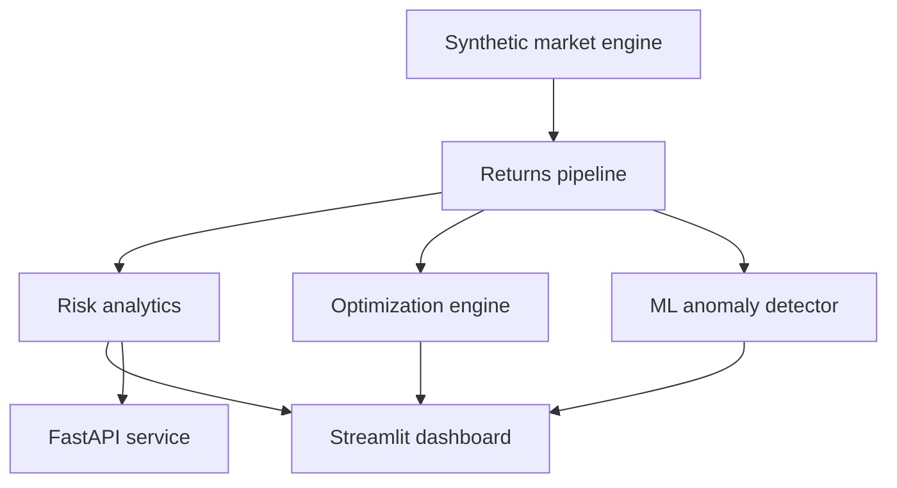

# 🛡️ MarketForge Attribution Analytics

### Institutional-grade portfolio analytics, risk intelligence and AI anomaly detection

[](https://python.org)
[](https://streamlit.io)
[](https://fastapi.tiangolo.com)
[](https://docker.com)
[](.github/workflows/ci.yml)
[](LICENSE)

MarketForge Attribution Analytics is an end-to-end financial analytics platform that transforms market data into portfolio decisions. It combines classical quantitative finance, Monte Carlo simulation, portfolio optimization and unsupervised machine learning in one interactive control center.

> The project runs fully offline with deterministic synthetic market data. No API key, account or paid data provider is required.

## ✨ Product tour

| Workspace | What it answers | Core visualizations |
|---|---|---|
| Executive Overview | How is the portfolio performing? | KPI cards, value curve, allocation donut, normalized prices |
| Risk Lab | Where does risk come from? | Rolling volatility, drawdown, risk attribution, correlation heatmap |
| Optimization | What allocation improves risk-adjusted return? | Efficient frontier, max-Sharpe allocation, weight comparison |
| Forecast | What could the portfolio be worth in one year? | 2,500 Monte Carlo paths, confidence bands, terminal distribution |
| Stress Tests | How does the portfolio react to shocks? | Scenario impact, loss estimates, custom shock attribution |
| AI Anomalies | Which market days require investigation? | Isolation Forest alerts, anomaly scores, market dispersion |

## 📊 Analytics included

- Annualized return and volatility
- Sharpe and Sortino ratios
- Maximum drawdown and underwater curve
- Historical Value at Risk and Conditional VaR
- Component risk contribution
- Rolling 60-day risk metrics
- Cross-asset correlation matrix
- Monte Carlo geometric wealth simulation
- Random-portfolio efficient frontier
- Maximum-Sharpe portfolio discovery
- Historical and custom scenario stress testing
- Isolation Forest anomaly detection

## 🧠 Architecture



```text
marketforge-attribution-analytics/
├── app/                    # Six-workspace Streamlit product
├── api/                    # FastAPI endpoints
├── core/
│   ├── data.py             # Reproducible market data engine
│   ├── risk.py             # Quantitative risk metrics
│   └── models.py           # Simulation, optimization and ML
├── tests/                  # Analytics and model tests
├── .github/workflows/      # Continuous integration
├── Dockerfile
├── docker-compose.yml
├── Makefile
└── requirements.txt
```

## 🚀 Quick start

```bash
git clone https://github.com/YOUR_USERNAME/marketforge-attribution-analytics.git
cd marketforge-attribution-analytics
python3 -m venv .venv
source .venv/bin/activate
pip install -r requirements.txt
streamlit run app/dashboard.py
```

Open `http://localhost:8501`.

### Start the API

```bash
uvicorn api.main:app --reload
```

- Swagger documentation: `http://localhost:8000/docs`
- Health endpoint: `http://localhost:8000/health`
- Portfolio metrics: `http://localhost:8000/portfolio/metrics`

### Run with Docker

```bash
docker compose up --build
```

This starts the dashboard on port `8501` and REST API on port `8000`.

## 🧪 Testing

```bash
pytest -q
```

The CI workflow runs the full test suite automatically on every push and pull request.

## 🔬 Model notes

### Monte Carlo forecasting

Daily multivariate returns are sampled from the empirical mean vector and covariance matrix. Each scenario compounds portfolio returns over 252 trading days to create a distribution of terminal values.

### Efficient frontier

Thousands of long-only allocations are sampled from a Dirichlet distribution. Expected return, volatility and Sharpe ratio are calculated for each portfolio; the maximum-Sharpe point is highlighted.

### Anomaly detection

Isolation Forest analyzes market movement, cross-sectional dispersion and an absolute-movement proxy. Its contamination parameter controls the expected alert rate.

## ⚠️ Disclaimer

MarketForge Attribution Analytics is an educational portfolio project. Synthetic data and model outputs are not financial advice and must not be used for real investment decisions.

## 📄 License

Released under the [MIT License](LICENSE). Copyright © 2026 Hadi Gholipour.
